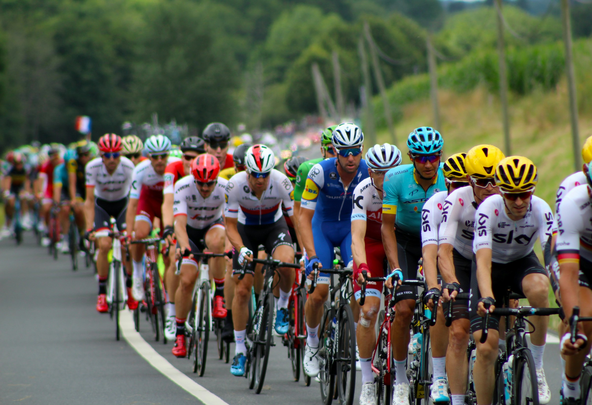

<p align="center">
  
</p>

# 🏆 Tour de France Winner Prediction & Historical Analysis

This data science project explores over a century of Tour de France history and applies machine learning to predict potential winners of the 2025 edition. The work includes data scraping, feature engineering, hybrid modeling, sentiment and odds analysis, and the deployment of a Streamlit dashboard.

---

## 📌 Project Overview

The project is structured around four key objectives:

1. **Historical Analysis (1903–2023):**
   - Analyze trends and patterns in Tour de France winners' profiles.
   - Explore how rider characteristics such as height, weight, BMI, and specialization have evolved over time.

2. **Machine Learning Model for 2025 Prediction:**
   - Data scraped from [ProCyclingStats](https://www.procyclingstats.com/) for all participants from 2014 to 2025.
   - Extensive feature engineering and experimentation with different feature sets.
   - Final model: **Random Forest** trained on 39 features.
   - Backtested on 2014 data to validate performance.

3. **Hybrid Prediction Approach:**
   - **UCI Ranking** and **PCS Ranking** integrated into final predictions.
   - Hybrid formula: **60% Machine Learning + 20% UCI Ranking + 20% PCS Ranking**.

4. **External Validation:**
   - **Sentiment Analysis** of news articles from [CyclingNews.com](https://www.cyclingnews.com/) to assess rider media presence and tone.
   - **Betting Odds** scraped from [oddset.de](https://www.oddset.de/) to compare with model predictions and market sentiment.

5. **Interactive Dashboard:**
   - A Streamlit app presents predictions, insights, and comparisons across models, rankings, sentiment, and odds.

---

## 📂 Data Sources

- **Historical Winners (1903–2023):**  
  Dataset from Kaggle: [Tour de France Winner Data](https://www.kaggle.com/datasets/gulliverwoods/tour-de-france-winner-data)

- **Race Participant Data (2014–2025):**  
  Scraped from [ProCyclingStats](https://www.procyclingstats.com/)  
  *(includes startlists for all riders, including provisional 2025 participants)*

- **Sentiment Analysis:**  
  Articles scraped from [CyclingNews.com](https://www.cyclingnews.com/)

- **Betting Odds:**  
  Collected from [oddset.de](https://www.oddset.de/)

---

## 📊 Tools & Technologies

- **Languages:** Python  
- **Libraries:** pandas, NumPy, scikit-learn, BeautifulSoup, requests, seaborn, matplotlib, nltk, xgboost  
- **Scraping:** ProCyclingStats, CyclingNews.com, oddset.de  
- **Modeling:** Random Forest, Hybrid Scoring  
- **Deployment:** Streamlit  
- **Version Control:** Git, GitHub

---

## 📁 Repository Structure

```
tour-de-france-project/
│
├── data/                        # Raw and processed datasets
│   ├── raw/                    # Scraped raw data
│   └── created_files/          # Cleaned/engineered datasets
│
├── notebooks/                  # Jupyter notebooks for EDA, modeling, scraping
├── app/                        # Streamlit dashboard code
├── scripts/                    # Python scripts for scraping and preprocessing
├── images/                     # Visualizations and assets
├── README.md                   # Project documentation
└── requirements.txt            # Dependencies
```

---

## 🔍 Key Insights

- **ML Model Validated by Real World:**  
  The model confidently predicted **Tadej Pogačar** as the 2025 favorite — aligning with **expert opinion** and **betting markets**.

- **Historical Trends Confirmed:**  
  Over more than a century of data, winners tend to fit a consistent profile:  
  **lightweight riders with low BMI and climber specialization**.  
  The model independently reinforced this archetype, confirming the findings from the 1903–2023 historical analysis.

- **Hybrid Modeling Adds Robustness:**  
  Incorporating **UCI** and **PCS** rankings improved prediction stability and allowed us to account for season performance trends.

- **The Human Element is Unpredictable:**  
  Despite a strong profile and ranking, **David Gaudu** was ranked high but **not selected** for the race — demonstrating limits of predictive models when facing team decisions.

---

## 🚀 Streamlit Dashboard

Explore predictions, feature insights, and ranking comparisons:

👉 [**Launch the App**](https://tour-de-france-predictions.streamlit.app/) 

---

## 🔧 Future Improvements

### 1. Live Prediction Model  
- Build a **dynamic model** that updates predictions after each stage.  
- Integrate **real-time data**: daily results, injuries, withdrawals, and time gaps.

### 2. Expand to New Challenges  
- Adapt the model to **Tour de France Femmes**.  
- Develop classification models to predict **jersey winners**: Yellow, Green, Polka Dot, White.

### 3. Enhance Feature Engineering  
- Add advanced rider metrics: **VO2 max**, **body fat %**, **injury history**, **recent results** (e.g., Critérium du Dauphiné).  
- Include **weather** and **environmental factors** affecting stage performance.

### 4. Deepen Stage Analysis  
- Create a **stage difficulty score** based on elevation, terrain, surface quality, and wind exposure.  
- Add **geo-visualizations** to highlight decisive stage segments.

---

## 🤝 Acknowledgements

- [ProCyclingStats](https://www.procyclingstats.com/) – Race data and rider profiles  
- [CyclingNews](https://www.cyclingnews.com/) – News sentiment  
- [oddset.de](https://www.oddset.de/) – Betting odds source  
- Code Academy Berlin – Data Science Bootcamp support

---

## 📜 License

This project is for educational purposes only and not intended for gambling or commercial prediction use.

---

